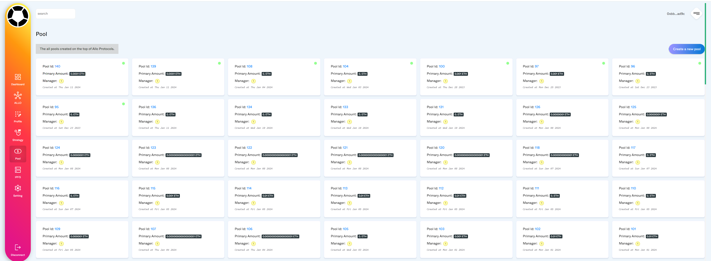

# Solidgrant
SolidGrant is a decentralized autonomous organization (DAO) dapp built on top of the Allo Protocol, a robust decentralized governance platform operating on the Arbitrum network. This innovative platform empowers communities to collaboratively make decisions, manage treasury funds, and foster transparency and accountability within their organizations.

## Demo
https://solidgrant.click

## Screenshot


## Key Features
Proposal and Voting: Members can propose ideas and vote on them, ensuring a democratic and inclusive decision-making process.

Treasury Management: The DAO's treasury funds are securely managed, allowing for transparent allocation and utilization of resources.

Community Activity Tracking: The platform provides tools to track and analyze community engagement, fostering a vibrant and active community.

Security and Transparency: Built on the secure and transparent foundation of the Arbitrum network and Allo Protocol, SolidGrant prioritizes the safety and integrity of the DAO's assets and operations.

## Benefits:

Decentralization: Power is distributed among the community members, eliminating the need for centralized authorities.

Transparency: All actions and decisions are recorded on the blockchain, ensuring transparency and accountability.

Security: Leveraging the security of the Arbitrum network and smart contract technology, SolidGrant offers a secure platform for governance.

Efficiency: Automated processes streamline governance operations, reducing administrative overhead.

Community Empowerment: Members have direct control over the DAO's direction and can actively participate in its growth and development.

Target Audience:

Communities and Organizations: Any group seeking to establish a decentralized governance structure can benefit from SolidGrant.

Developers: Developers can leverage the platform's APIs to build custom applications and integrations.

Crypto Enthusiasts: Individuals passionate about decentralized technologies and community-driven initiatives can participate in the DAO's governance and decision-making processes.
## Install
```
git clone 
cd solidgrant
npm i
npm run dev
```