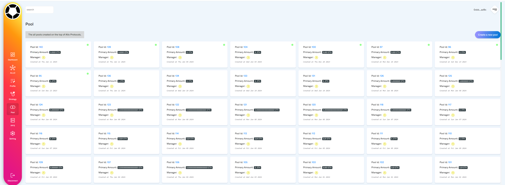

## Solidgrant
--------

<a href="//arbitrum.io"></a>

<a href="/test"></a>


<a href="//twitter.com/atenyun"></a>

### Demo
➡️ <a href="https://solidgrant.click" target="blank">https://solidgrant.click</a>


### Description

SolidGrant is a decentralized autonomous organization (DAO) dapp built on top of the Allo Protocol, a robust decentralized governance platform operating on the Arbitrum network. This innovative platform empowers communities to collaboratively make decisions, manage treasury funds, and foster transparency and accountability within their organizations.

### Key Features

**Proposal and Voting:** Members can propose ideas and vote on them, ensuring a democratic and inclusive decision-making process.

**Treasury Management:** The DAO's treasury funds are securely managed, allowing for transparent allocation and utilization of resources.

**Community Activity Tracking:** The platform provides tools to track and analyze community engagement, fostering a vibrant and active community.

**Security and Transparency:** Built on the secure and transparent foundation of the Arbitrum network and Allo Protocol, SolidGrant prioritizes the safety and integrity of the DAO's assets and operations.

### UI/UX



### API (endpoints)
https://solidgrant.aratta.dev/v1/

### Installation

```
git clone https://github.com/web3senior/solidgrant
cd nightly
npm run dev
```

➜ Ready on localhost💥

### Usage

1️⃣ Connect your web3 wallet

2️⃣ Switch to Arbitrum network

3️⃣ Start by creating a new profile

### Contributing

Pull requests are welcome. For major changes, please open an issue first to discuss what you would like to change.